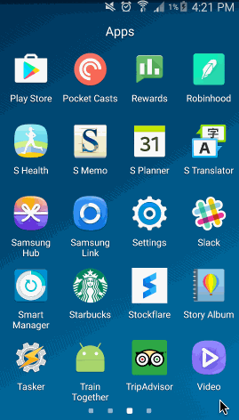
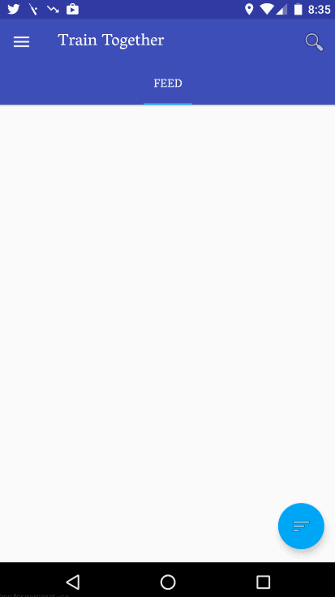

# Project - Train Together 

## Introduction
Planning to run a marathon is not an easy task. It involves meticulous planning, keeping track of performance over time and also being motivated. While training individually is initially fun, the motivation usually tapers off while training alone and it isn't something you are enthusiastic about it anymore. But suppose, you were to have like-minded individuals with whom you could team up or group with the intention of running together, training and working hard to achieve your goal, then it would help keep up the motivation level high and also provide inspiration and enthusiasm to honor the commitment. The idea is to essentially build an app which would help individuals find running partners around nearby locations, thereby enabling people to **train together** for a particular marathon. The app will help pair people to create groups and choose partners who have the same marathon event interest. It will allow users to run and train together, compare statistics, inspire each other and finally compete at the marathon successfully.

## User Stories

### The following **required** user stories/features are:

* [x]	User can **view upcoming events and other’s participation** in the home feed
* [ ]	User can **view training session statistics**
  * [ ] User is displayed the statistics for each session and is provided with visualizations for group as well as individual statistics
* [ ]	User can **view profile and update preferences**
* [x]	User can **chat with other people in the group**
* [ ]	User can **view the leaderboard**
* [ ]	User can **start a run** and see current run map along with statistics
	* [ ] Optional: Voice information on run events
* [x]	User can request to join groups
* [x]	Any user is able to view upcoming events and look around before joining a event which will be allowed after account creation

### The following **optional** identified user stories/features are:
* [ ]	User can **invite friends and join events to train together**
* [ ]	User can **view training schedules**
    * [ ] User is displayed the provided with a training schedule and can modify as per preference
    * [ ] User get notification on runs based on training schedules
* [x]	User can search marathons based on a **query and any distance**
* [ ]	User can **track current run on google maps**
* [ ]	User can **view personal statistics**
* [ ]	Final event tracking
* [ ]	Name groups ("\<random name\> - \<marathon name\>"")
* [ ]	User can **view previous runs on Google Maps**
* [ ]	Users are **provided reminders about upcoming events**
* [ ]	Users are **matched to volunteering trainers / mentors**
* [ ]	User can **unlock new achievements**
* [ ]	**Stretch**: Monetize the app using trainers available ads and local sporting goods store ads 
* [ ]	**Stretch**: Integrate Spotify music
* [ ]	**Stretch**: Google watch app 

## Walkthroughs (Sprint 1):
1. Upcoming Events Feed / Login / Chat 
 

 

2. Leaderboard
 

 

3. Group formation
 

 

4. Preferences & Training Schedule
 

 

## Wireframes:
1. Home Navigation
 
**Walkthrough**
 
</img>
 
**Screenshots**
 
</img>
</img>
</img>
</img>

2. Record Runs
 
**Walkthrough**
 
</img>

3. Statistics Screen
 
</img>
